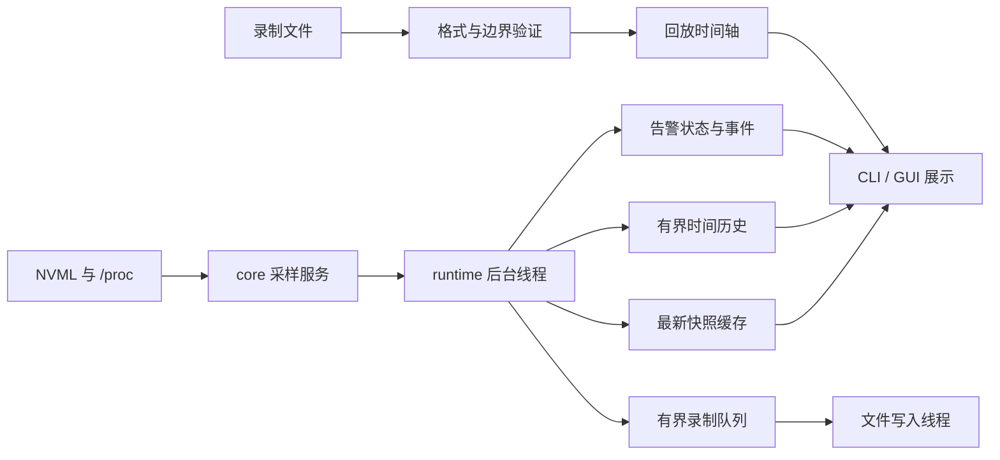

# 系统架构

[项目首页](../README.md) · [功能与使用](features.md) · [数据接口](data-model.md) · [开发指南](development.md)

## 分层与数据流

项目由四个 Rust crate 和 GUI 前端组成：

| 层 | 职责 |
| --- | --- |
| `gpu-monitor-core` | NVML 适配、进程元数据、共享快照、错误分层与初始化恢复 |
| `gpu-monitor-runtime` | 后台采样、缓存、时间历史、录制、回放读取和告警评估 |
| `gpu-monitor-cli` | 参数、筛选排序、文本 / JSON、TUI、录制与回放命令 |
| `gpu-monitor-gui` | Tauri 生命周期、运行时 IPC、文件任务和桌面通知 |
| `src-web` | React 状态、设备 / 进程视图、历史图、回放与交互 |

CLI 和 GUI 各自创建一个独立运行时，不共享进程间缓存、录制或规则。一个应用内所有视图读取同一个采样结果，不为每张卡、每个组件创建额外 NVML 会话。

## 采样边界

`MonitorService` 懒初始化 NVML，单次 `sample()` 返回带时间和错误的快照。身份读取失败进入 `failures`，指标失败保留 nullable 值和 `issues`；一张卡失败不取消其他卡结果。

设备稳定身份按 UUID 管理；可能改变的指标和功耗上限继续重新读取。计算与图形进程先在同一 GPU 内按 PID 合并，再查询 `/proc` 元数据。读取前后的进程启动标识用于检测退出和 PID 重用；元数据不可用不会升级成驱动故障。用户名读取本地 `/etc/passwd`，不等待网络名称解析。

初始化和枚举失败使用单调时钟退避，延迟为 1、2、4……秒，最多 30 秒。显式 retry 重置退避，请求在下一次可执行的采样前处理。无法从外部强制取消已进入 NVML 的调用。

## 后台运行时与交互响应

`MonitorRuntime::new(Duration)` 启动一个持有采样器的后台线程。采样结束后，线程将快照提交录制队列，更新历史和告警，再发布快照。`latest()` 只复制最近完成的数据；`history()`、`events()` 和状态读取也不执行驱动或磁盘操作。

GUI IPC 与 TUI 输入循环只访问上述缓存。缓存锁不覆盖 NVML 调用；文件创建 / 载入和通知调用在独立的阻塞任务或写入线程中执行。重试通道有界并合并连续请求。

Rust / TypeScript 的 UI 状态按 UUID 保存最后成功数据，错误期间提供 stale 状态而非清空所有卡。筛选、排序、详情切换属于展示逻辑。TUI 将实时缓存和录制回放统一为 `Feed`，因此两种来源使用相同导航、过滤和渲染代码。

前端各轮询通道限制一个未完成请求，组件清理后忽略旧结果。快照和较大历史 / 工具状态可按不同频率读取；后台历史仍逐次记录，不受前端轮询间隔影响。

## 时间与历史

Unix 毫秒时间用于展示和外部记录；单调时钟用于退避、阈值持续 / 冷却和内存保留。系统时钟回拨不改变采集顺序。回放按相邻非负时间差推进，回拨处立即衔接，展示图从新的时间段重新建立。

共享历史只保存图表需要的指标，不保存进程和完整设备对象。正常保留最长一小时，另有 36,001 帧和 120,000 GPU 数据点两个上限；到达任一上限时移除最旧帧。失败帧可以为空，但仍占据时间位置，保证中断不会被压缩成连续有效读数。

GUI 使用真实采样时间绘图并区分缺口；TUI 将窗口按屏幕宽度聚合为等时间桶，保留有效峰值和缺测状态。高密度设备或更高采样频率可能先触发数据点上限，因此选择一小时窗口不保证已经拥有整小时数据。

## 录制与回放

录制开始时将已有快照作为首帧加入队列，再接收新的实际采样。32 帧有界队列使用非阻塞提交；队列满时增加 dropped 计数，避免慢磁盘阻塞采样。专用线程顺序写 JSON Lines，默认删除进程完整参数。

文件采用 `create_new`，Linux 权限为 `0600`，不覆盖已有文件。录制同时受 64 MiB、24 小时、86,400 帧和单帧 4 MiB 限制。状态分别表示接收新帧、排空队列、成功字节 / 帧数、丢帧和错误。

回放读取器验证普通文件、体积、帧数、单帧大小、schema、可表示时间范围、同帧 UUID 唯一性和 GPU 时间不晚于外层快照。打开时使用非阻塞方式并拒绝特殊文件，避免打开 FIFO 时等待写入端。JSON 数组不是录制格式。

回放读取和播放不调用 GPU。CLI 回放不创建实时运行时，GUI 切换回放时保留已有的实时运行时。CLI 使用独立时间调度器；GUI 建立按设备和时间段的索引以支持按帧定位，不必每次从第一帧重新计算整个会话。展示筛选不改变录制原始内容。

## 告警状态机

温度和显存容量分别维护 pending / active 状态。达到触发阈值后需持续指定时间，触发后只有测量值降到独立恢复阈值才恢复；冷却时间限制再次触发。缺测或超过三倍采样周期的间断清除尚未触发的 pending 状态，不凭缺测解除 active 告警。

设备和全局可用性使用状态转换事件，连续相同故障不重复生成事件。按 UUID 跟踪设备；身份尚未取得时暂用 `index:N`，恢复后关联真实设备。事件保留最多 500 条，设备告警状态最多 1,024 个。

监控规则属于会话。GUI 默认开启，CLI 可通过 `--alerts` 或 `alerts` 子命令启用。桌面通知是 GUI 的独立选择，仅对开启后的新事件发送；通知服务不参与采样或告警判定。

## 退出与故障边界

运行时释放时发出停止信号并唤醒空闲采样线程，不 join 可能永久阻塞的驱动调用。因此主界面关闭不需要等待 NVML 返回；完全挂起的驱动不会恢复采样，重启应用或修复驱动后再连接。

有活动录制时，CLI 和 GUI 先请求停止并等待最多五秒排空。错误、丢帧或超时会明确报告；GUI 在收尾后使用对应退出状态。记录收尾等待不持有 UI 线程，也不等待采样线程。

终端通过 RAII 恢复 raw mode 和备用屏幕，覆盖正常退出、错误返回及 panic 展开。开发启动器单独拥有依赖安装 / Tauri 子进程组，结束时只清理自己创建的进程。

项目没有常驻守护进程、远程服务器、数据库、持久规则配置或 GPU 控制接口。AMD / Intel、MIG 实例和跨主机监控需要新的后端与身份模型。
