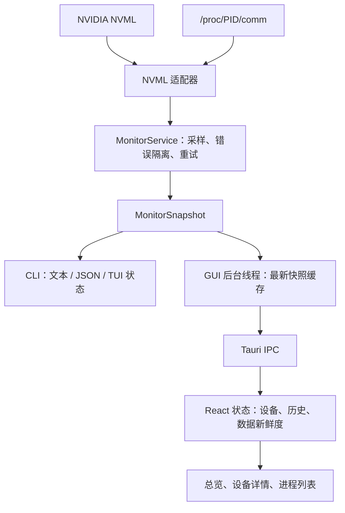

# 系统架构

[项目首页](../README.md) · [功能设计](features.md) · [数据接口](data-model.md) · [开发指南](development.md)

## 模块职责

项目使用 Cargo workspace，将硬件采集与两种交互界面分开。CLI 和 GUI 复用同一套采样模型，各自在进程内持有采集服务。

| 模块 | 职责 | 主要入口 |
| --- | --- | --- |
| `gpu-monitor-core` | NVML 适配、设备身份、采样快照、错误分类与初始化重试 | [service.rs](../crates/gpu-monitor-core/src/service.rs)、[monitor.rs](../crates/gpu-monitor-core/src/monitor.rs) |
| `gpu-monitor-cli` | 参数解析、文本/JSON 输出、TUI 导航与历史状态 | [main.rs](../crates/gpu-monitor-cli/src/main.rs)、[app.rs](../crates/gpu-monitor-cli/src/app.rs)、[ui.rs](../crates/gpu-monitor-cli/src/ui.rs) |
| `gpu-monitor-gui` 的 Rust 部分 | 后台采样线程、最新快照缓存与 Tauri IPC | [worker.rs](../crates/gpu-monitor-gui/src/worker.rs)、[commands.rs](../crates/gpu-monitor-gui/src/commands.rs) |
| `gpu-monitor-gui/src-web` | 前端轮询、按 UUID 管理历史、总览/详情和进程展示 | [useMonitor.ts](../crates/gpu-monitor-gui/src-web/src/monitor/useMonitor.ts)、[state.ts](../crates/gpu-monitor-gui/src-web/src/monitor/state.ts) |

图中表示复用关系。CLI 与 GUI 同时运行时，各自采样，不通过共享守护进程交换数据。

## 采样服务

`MonitorService::new()` 只创建服务状态，首次 `sample()` 才加载并初始化 NVML。这样界面可以先启动，再展示连接状态或初始化错误。

一次采样依次执行：

1. 检查 NVML 会话是否可用，以及是否达到下一次初始化重试时间。
2. 枚举当前设备；枚举失败或设备数为零时生成全局错误。
3. 按索引依次查询每张卡。设备身份查询失败时记录该卡错误，继续处理其他设备。
4. 查询指标及进程，将局部失败记录到对应设备的 `issues`。
5. 返回包含数据与错误的快照；需要重新初始化会话时，安排后续重试。

采样在 core 中是同步操作，调度周期由调用方决定。快照时间戳在采样轮次开始时生成；当前同一轮内各 GPU 使用相同时间戳。不同设备和指标的读取存在先后顺序，快照不代表所有硬件指标在同一瞬间被原子读取。

### 设备身份与缓存

GPU 索引用于当次枚举和界面导航，UUID 用于关联同一设备。适配器按 UUID 缓存成功读取的设备名称、PCI 信息和驱动信息，避免每轮重复查询。

显存、负载、温度、进程和功耗上限等可能变化的数据继续采样。设备索引变化时更新索引，避免把别的 GPU 的历史关联到当前设备。

### 错误分层

| 层次 | 快照位置 | 表达的状态 |
| --- | --- | --- |
| 全局服务 | `error` | NVML 初始化、设备枚举失败或未发现设备 |
| 整张设备 | `failures` | 无法取得某张 GPU 的句柄或必要身份信息 |
| 设备内指标 | `gpus[].issues` | 某项指标或某类进程查询不可用 |

指标读取失败时，值为 `null`，错误原因保留在 `issues`。进程查询失败时，保留另一类成功查询的进程并标记结果不完整。健康设备和健康指标仍可被使用。

### 初始化恢复

初始化或枚举失败后，服务按 1、2、4、8、16、30 秒的间隔退避，后续间隔上限为 30 秒。调度使用单调时钟，快照使用 Unix 毫秒时间戳。

采样结果中出现会话未初始化错误时，先返回本轮已有结果，再重建会话。手动 `retry()` 清除退避和当前会话，使下一次采样重新初始化。普通指标不支持或单卡故障不触发所有设备的整轮失败。

## GUI 并发与生命周期

GUI 的一个后台线程独占 `MonitorService`。线程每次采样完成后替换缓存，通常等待 1 秒再采下一轮；连续点击重试会在容量为 1 的通道中合并。

IPC 只读取已完成的缓存或发送重试信号。缓存锁仅用于读写快照，不覆盖 NVML 调用，因此慢采样不会长时间占用 IPC 所需的锁。首次采样尚未完成时，读取接口返回等待提示。

前端在一次快照请求结束后等待 1 秒再请求，最多保留一个正在进行的快照请求。组件卸载时清理定时器并忽略迟到的结果。独立的前端时钟负责推进曲线时间轴和计算数据是否过期。

缓存只保存最新快照，不是采样队列。前端较慢时可能跳过中间快照；图表记录实际收到的新样本，用于观察近期趋势，不保证完整保留每次后台采样。

退出时向采样线程发送停止信号并唤醒空闲等待，不在 UI 线程等待阻塞中的 NVML 调用。若驱动调用一直不返回，该线程无法继续采样，也无法立即执行重试；GUI 会将旧数据显示为过期，窗口仍可关闭。

## 两端的展示状态

TUI 将选择的设备、进程滚动位置和历史按 UUID 保存。布局先计算进程表实际可见行数，再限制滚动范围。明确设备故障或全局错误时保留上一次数据；成功枚举中已经消失的设备从 TUI 状态移除。

GUI 将设备与历史保存在独立状态层，筛选框、卡片和详情页只控制展示。设备暂时缺席或发生错误时保留已有条目并标为过期，同一 UUID 再次出现后继续更新。卡片卸载不会删除历史。

两端历史均只存在于当前应用进程内，关闭应用后不保留。具体时间窗口和交互见[功能设计](features.md)。

## 架构边界

当前面向单机、物理 NVIDIA GPU。没有数据库、远程服务、告警执行器或 GPU 控制接口；进程列表仅用于查看，不提供终止进程操作。

内部 `Backend` 接口用于隔离 NVML 和测试替身。Rust 快照是 CLI JSON 与 GUI IPC 的共同数据契约，前端集中声明对应类型。新增字段或错误类别时，需要同步两端类型、展示语义和[接口文档](data-model.md)。
